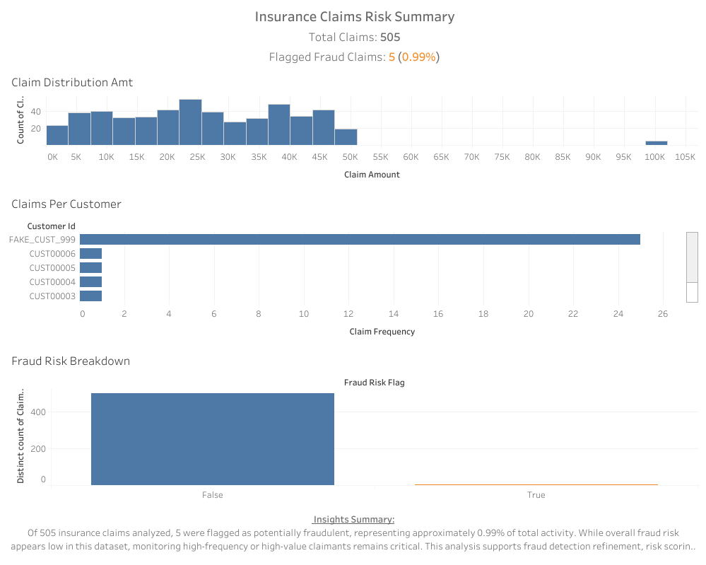

# 🧾 Insurance Claims Risk Dashboard Project

## 📌 Project Overview

This project demonstrates how to analyze insurance claims data by applying a complete actuarial data science workflow using Python and Tableau. It showcases data cleaning, feature engineering, fraud detection, and stakeholder-ready visualizations.

The goal: **Identify potential fraudulent activities, assess customer risk profiles, and deliver insights to stakeholders through a clear visual dashboard**.

---

## 🔁 Workflow: Ask → Prepare → Process → Analyze → Share → Act

### ✅ ASK
The goal of this project was to explore the feasibility of using basic feature engineering and rule-based risk scoring to flag potentially fraudulent insurance claims in a simplified dataset.

The focus was on:
- Cleaning and merging claims and customer data
- Creating basic risk flags using thresholds
- Testing with a synthetic fraudulent claim
- Building a proof-of-concept Tableau dashboard for stakeholder presentation

---

### 🧹 PREPARE
- Loaded raw datasets: `Insurance_Claims_Data.csv` and `Insurance_Customers_Data.csv`
- Inspected for missing values, data types, and duplicates
- Standardized column names and merged datasets on `customer_id`
- Saved the result to `Cleaned_Merged_Insurance_Data.csv`

---

### 🧪 PROCESS
- Feature engineered new metrics:
  - `claim_to_premium_ratio`
  - `is_high_risk` (binary flag)
  - `processing_efficiency`
- Exported as `Feature_Engineered_Insurance_Data_with_ClaimID.csv`

---

### 🔍 ANALYZE
- Generated synthetic `claim_id` values in the format `CL101`, `CL102`, etc.
- Injected a controlled fake fraudulent record to test risk scoring logic
- Created fraud detection logic based on:
  - High claim amount thresholds
  - Claim frequency
- Flagged high-risk and potentially fraudulent claims
- Final dataset saved as: `Final_Insurance_Claims_Data.csv`

---

### 📊 SHARE
- Created a stakeholder-facing dashboard using Tableau Desktop & Tableau Public
- Included KPIs and visual insights:
  - Total Claims
  - Total Fraud Claims
  - Percent Fraud
  - Top 5 Claim Submitters
  - Claims Distribution by Policy Type
  - Risk Breakdown by Flag Type

---

### 💡 ACT
**Recommendation for stakeholders**:
- Investigate claimants with unusually high claim frequencies
- Review customers with high claim-to-premium ratios
- Use this dashboard as an early detection tool for fraud patterns

---

## 🛠️ Tech Stack

| Tool      | Purpose                         |
|-----------|----------------------------------|
| Python    | Data cleaning, feature engineering, fraud logic |
| Pandas    | Data manipulation               |
| Tableau   | Dashboard & stakeholder insights |
| GitHub    | Version control & portfolio hosting |

---

## 🖼️ Dashboard Snapshot



---

## 📂 File Structure

```
Insurance_Analytics/
├── data/
│   ├── raw/
│   │   ├── Insurance_Claims_Data.csv
│   │   └── Insurance_Customers_Data.csv
│   ├── processed/
│   │   ├── Cleaned_Merged_Insurance_Data.csv
│   │   ├── Feature_Engineered_Insurance_Data_with_ClaimID.csv
│   │   └── Final_Insurance_Claims_Data.csv
├── scripts/
│   ├── insurance_data_cleaning.py
│   ├── insurance_feature_engineering.py
│   ├── inject_fake_fraud_case.py
│   └── risk_scoring_fraud_detection.py
├── Insurance_Claims_Risk_Summary.png
└── README.md
```


## 🧾 Script Summary Log

| Script | Purpose |
|--------|---------|
| `insurance_data_cleaning.py` | Cleaned and merged customer and claims data |
| `insurance_feature_engineering.py` | Created engineered features like ratios and risk flags |
| `inject_fake_fraud_case.py` | Injected synthetic fraudulent claim for testing logic |
| `risk_scoring_fraud_detection.py` | Applied fraud and risk scoring logic to final dataset |


## 📎 Resources

- [Tableau Public Dashboard](https://public.tableau.com/app/profile/kent.ward2777/viz/Insurance_Claim_Risk_Summary/Insurance_Claims_Risk_Summary)  
  

---
